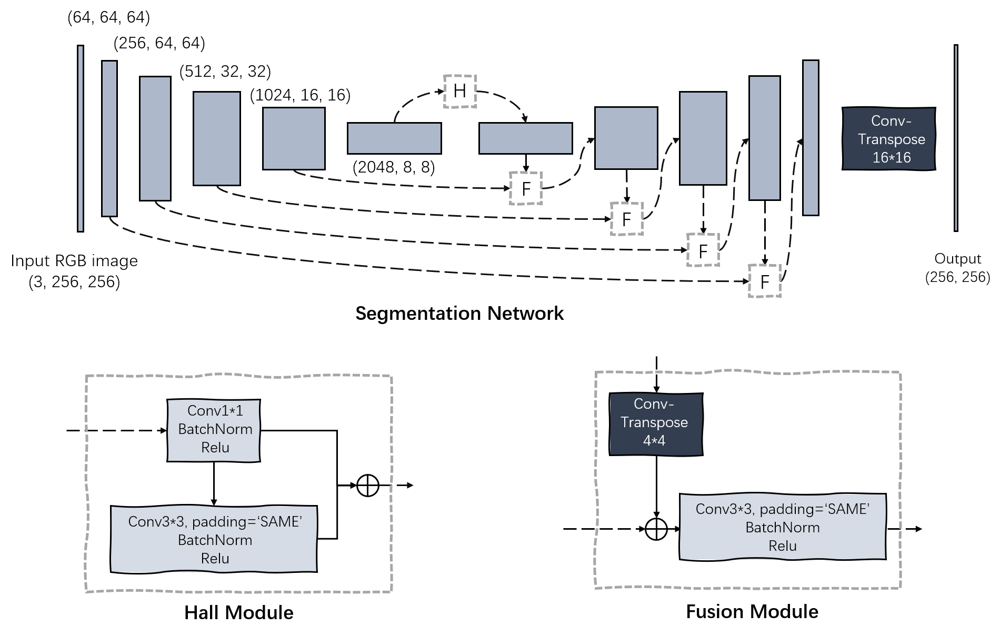

# RoadSeg_Pytorch

This is an road segmentation network of Pytorch, which is inspired by [KittiSeg](https://github.com/MarvinTeichmann/KittiSeg). The detailed network structure is shown in the following figure. 

<div align="center">
	
</div>


## Set Up

1. Set up the environment by Virtualenv: 

```bash
virtualenv env
source enb/bin/activate

# install pytorch for Linux, CUDA=10.1
pip install torch==1.7.1+cu101 torchvision==0.8.2+cu101 torchaudio==0.7.2 -f https://download.pytorch.org/whl/torch_stable.html
# more details could be found: https://pytorch.org/get-started/locally/

pip install tqdm opencv-python
```

2. Download KITTI road dataset: http://www.cvlibs.net/download.php?file=data_road.zip

The dataset structure is shown below. Because it does not provide the ground-truth of testing data, we only use the training data. When loading the dataset, we split training data into three subsets: a) training (173 images), b) validation (58 images), and c) testing (58 images). 

```bash
|_data
    |_data_road
        |_training
        |   |_calib
        |   |_image_2
        |   |_gt_image_2
        |_testing
            |_calib
            |_image_2
```

## Train

```bash
CUDA_VISIBLE_DEVICES=1 python train.py --dataset ./data/data_road/ --batchSize 12 --nepoch 24 --model ./checkpoints/model_23.pth
```

## Performance

Epoch 24 glob acc : 0.913, pre : 0.953, recall : 0.370, F_score : 0.533, IoU : 0.69

Epoch 48 glob acc : 0.922, pre : 0.931, recall : 0.453, F_score : 0.610, IoU : 0.79

Epoch 72 glob acc : 0.926, pre : 0.934, recall : 0.486, F_score : 0.639, IoU : 0.79

Epoch 96 glob acc : 0.926, pre : 0.938, recall : 0.475, F_score : 0.631, IoU : 0.79