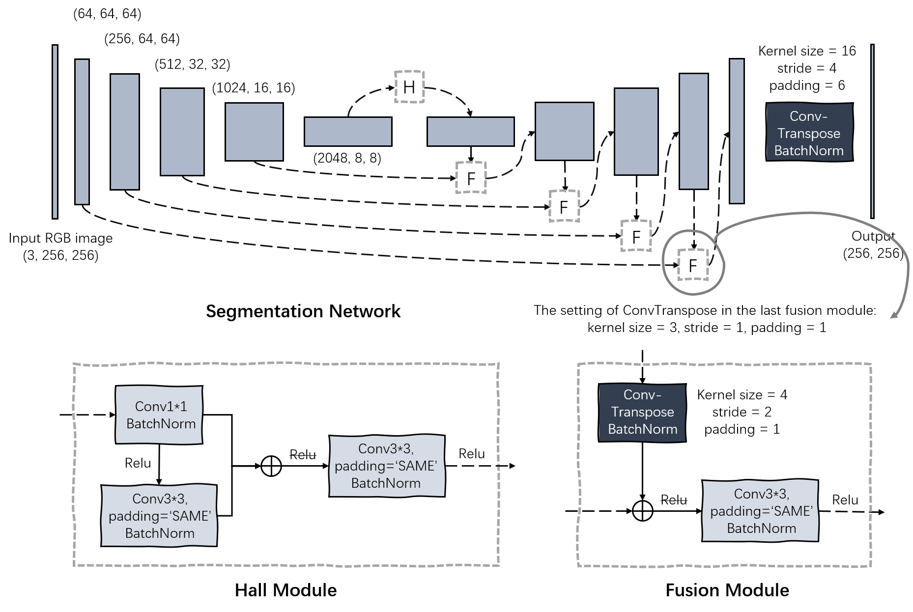

<!--
 * @Author: JosieHong
 * @Date: 2021-01-30 15:54:39
 * @LastEditAuthor: JosieHong
 * @LastEditTime: 2021-02-01 17:22:08
-->
# RoadSeg_Pytorch

This is an road segmentation network of Pytorch, which is inspired by [KittiSeg](https://github.com/MarvinTeichmann/KittiSeg). 

<div align="center">
	
</div>

## Set Up

1. Set up the environment by Virtualenv: 

```bash
virtualenv env
source enb/bin/activate

# install pytorch for Linux, CUDA=10.1
pip install torch==1.7.1+cu101 torchvision==0.8.2+cu101 torchaudio==0.7.2 -f https://download.pytorch.org/whl/torch_stable.html
# more details could be found: https://pytorch.org/get-started/locally/

pip install tqdm opencv-python
```

2. Download KITTI road dataset: http://www.cvlibs.net/download.php?file=data_road.zip

```bash
|_data
    |_data_road
        |_train
        |   |_calib
        |   |_image_2
        |   |_gt_image_2
        |_testing
            |_calib
            |_image_2
```

## Train

```bash
CUDA_VISIBLE_DEVICES=1 python train.py --dataset ./data/data_road/ --batchSize 12 --nepoch 24 --model ./checkpoints/model_23.pth
```

Epoch 24 glob acc : 0.880, pre : 0.732, recall : 0.199, F_score : 0.313, IoU : 0.185